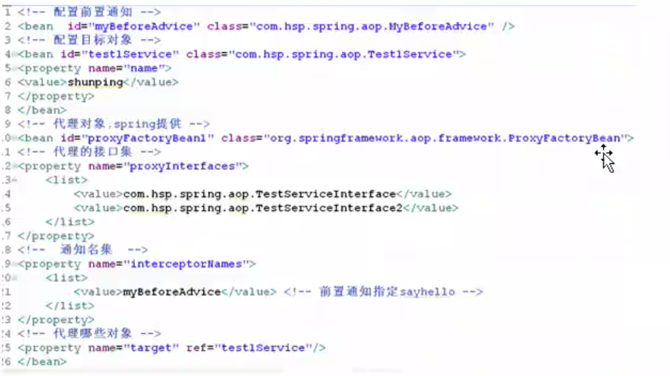
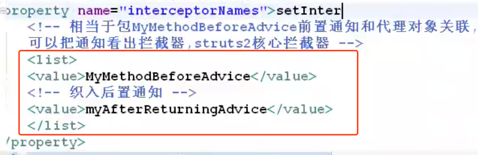

# AOP编程

是对所有对象或者一类对象进行编程。

核心是（不，还）：在不增加代码的基础上还增加功能。

## 1.面向切面编程

面向n多对象的编程。 相关的概念：

* 1.aop编程，实际上在框架本身用的很多。在实际项目开发中用的不是很多。将来会越来越多。这是一个趋势。

## 2.aop原理


### 2.1.在beans.xml中要配置的东西

* 1.被代理的对象
* 2.前置通知
* 3.配置代理对象

### 2.2.开发步助如下

* 1.定义接口
* 2.编写对象（被代理的对象，也就是目标对象）
* 3.编写通知（前置通知，在目标方法前调用的方法）
* 4.在beans.xml文件中配置。

  

  * 配置 被代理的对象=目标对象
  * 配置通知
  * 配置代理对象，是ProxyFactoryBean的对象实例。
    * 代理接口集
    * 织入通知
    * 配置被代理对象

### 2.3.相关概念

* 1.通知:就类似与上图before函数中的东西，也就是切面的实际实现，比如在日志通知中包含了实现日志功能的代码。
* 2.目标对象：被通知的对象，也就是目标对象，通知这个对象在执行某一个动作前，先进行写日志。
* 3.代理：将通知应用到目标对象后创建的对象。
* 4.织入：将切面应用到目标对象从而创建一个新的代理对象。织入发生在目标对象生命周期的多个点上：
  * 编译
  * 装载
  * 运行
* 5.连接点：应用程序执行过程中插入切面的地点，可以是方法调用，异常抛出，或者要修改的字段。
* 6.切入点：定义了通知应该应用到哪些连接点，通知可以应用到aop框架支持的任何连接点。

  **连接点是个静态的概念，切入点是个动态的概念。连接点会变成切入点**

  ```text
  举个例子：
  比如上面我们在aop里面配置了testService，里面右边两个方法，一个是sayHello,一个是sayBye().这个时候这两个函数都是连接点，但是如果我们指定只是在sayHello之前写日志，那么sayHello就成为了切入点，而sayBye永远都只是连接点。
  ```

## 3.举个例子，用注解实现aop

一个简单的类

```text
package com.study.spring.aop;


public class Knight {

    public void saying(){
        System.out.println("我是一个骑士");
    }
}
```

定义一个切面

```text
package com.study.spring.aop;

import org.aspectj.lang.annotation.Aspect;
import org.aspectj.lang.annotation.Before;

@Aspect
public class AspectTest {

    public static final String EDP = "execution(* com.study.spring.aop.Knight.saying(..))";

    @Before(EDP)
    public void sayHello(){
        System.out.println("注解类型前置通知");
    }
}
```

配置

```text
package com.study.spring.aop;

import org.springframework.context.annotation.Bean;
import org.springframework.context.annotation.Configuration;
import org.springframework.context.annotation.EnableAspectJAutoProxy;

@Configuration
@EnableAspectJAutoProxy
public class AopConfig {

    @Bean
    public AspectTest aspectTest(){
        return new AspectTest();
    }

    @Bean
    public Knight knight(){
        return new Knight();
    }
}
```

使用

```text
ApplicationContext ac = new AnnotationConfigApplicationContext(AopConfig.class);
        ac.getBean(Knight.class).saying();
```

说明：

* 1.在切面类（为切点服务的类）前用@Aspect注释修饰，声明为一个切面类。
* 2.用@Pointcut注释声明一个切点，目的是为了告诉切面，谁是它的服务对象。（表示在谁之前或者之后要干个什么事）
* 3.@EnableAspectJAutoProxy开启自动代理。（相当于实现了上面的代理类）

## 4.其他的通知

类似的还有after.around等通知类型，如果使用xml配置的方式。 那么你需要再去实现after的相关接口，然后在xml文件中进行配置 



 但是当你使用注解的方式时，直接使用

```text
@After(EDP)
public void sayBye(){
    System.out.println("注解类型后置通知");
}
```

**什么是环绕通知** 在执行目标对象的前和后，给你一个机会，做aop.

```text
//    @Around(EDP)
//    public void  sayAround(ProceedingJoinPoint proceedingJoinPoint){
//        try {
//            System.out.println("around前");
//            proceedingJoinPoint.proceed();
//            System.out.println("around后");
//        }catch (Throwable e ){
//            System.out.println("error");
//        }
//
//    }
//异常通知
    @AfterThrowing(pointcut = EDP, throwing = "ex")
    public void afterThrowing(JoinPoint joinPoint, Exception ex){

        String methodName = joinPoint.getSignature().getName();
        System.out.println("异常通知方法"+methodName + "发生异常" + ex);

    }
```

## 5.总结

spring的AOP中，当你通过代理对象去实现aop技术的时候，获取的proxyFactorybean是什么类型？ 答：返回的是一个代理对象。如果目标对象实现了接口，则spring使用的是jdk的动态代理技术完成。如果目标对象没有实现接口，则spring使用的是CHLIB技术完成。

定义切入点的支持正则表达式： 


