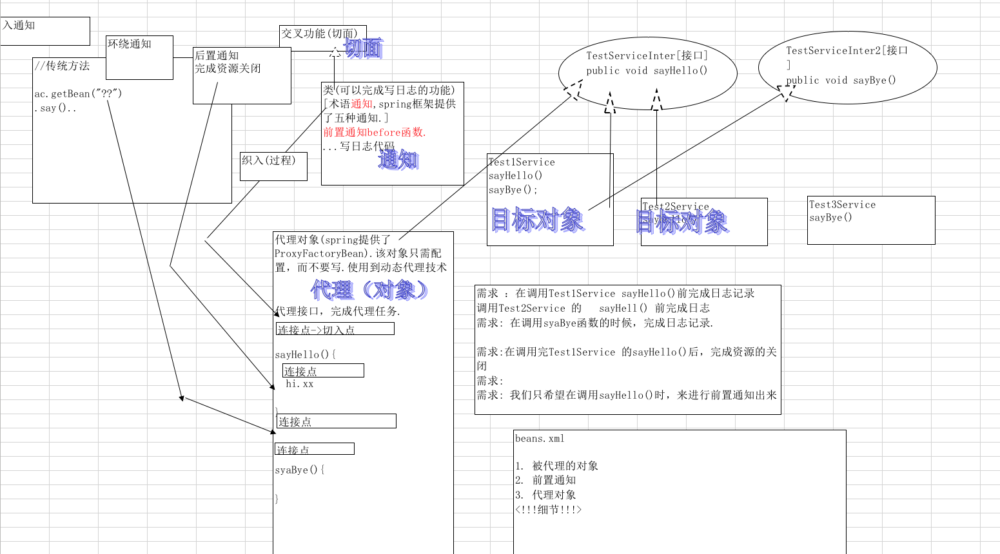

# AOP编程

是对所有对象或者一类对象进行编程。

核心是（不，还）：在不增加代码的基础上还增加功能。

### 1.面向切面编程
面向n多对象的编程。
相关的概念：
* 1.aop编程，实际上在框架本身用的很多。在实际项目开发中用的不是很多。将来会越来越多。这是一个趋势。

### 2.aop原理

#### 2.1.在beans.xml中要配置的东西
* 1.被代理的对象
* 2.前置通知
* 3.配置代理对象

#### 2.2.开发步助如下
* 1.定义接口
* 2.编写对象（被代理的对象，也就是目标对象）
* 3.编写通知（前置通知，在目标方法前调用的方法）
* 4.在beans.xml文件中配置。

  - 配置 被代理的对象=目标对象
  - 配置通知
  - 配置代理对象，是ProxyFactoryBean的对象实例。
    - 代理接口集
    - 织入通知
    - 配置被代理对象

#### 2.3.相关概念
* 1.通知:就类似与上图before函数中的东西，也就是切面的实际实现，比如在日志通知中包含了实现日志功能的代码。
* 2.目标对象：被通知的对象，也就是目标对象，通知这个对象在执行某一个动作前，先进行写日志。
* 3.代理：将通知应用到目标对象后创建的对象。
* 4.织入：将切面应用到目标对象从而创建一个新的代理对象。织入发生在目标对象生命周期的多个点上：
  - 编译
  - 装载
  - 运行
* 5.连接点：应用程序执行过程中插入切面的地点，可以是方法调用，异常抛出，或者要修改的字段。
* 6.切入点：定义了通知应该应用到哪些连接点，通知可以应用到aop框架支持的任何连接点。
**连接点是个静态的概念，切入点是个动态的概念。连接点会变成切入点**
```
举个例子：
比如上面我们在aop里面配置了testService，里面右边两个方法，一个是sayHello,一个是sayBye().这个时候这两个函数都是连接点，但是如果我们指定只是在sayHello之前写日志，那么sayHello就成为了切入点，而sayBye永远都只是连接点。
```
