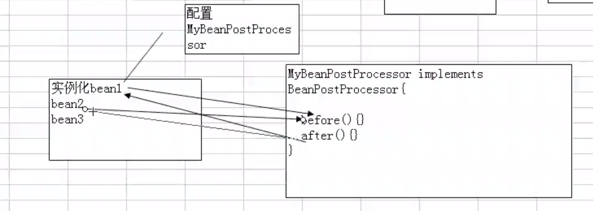
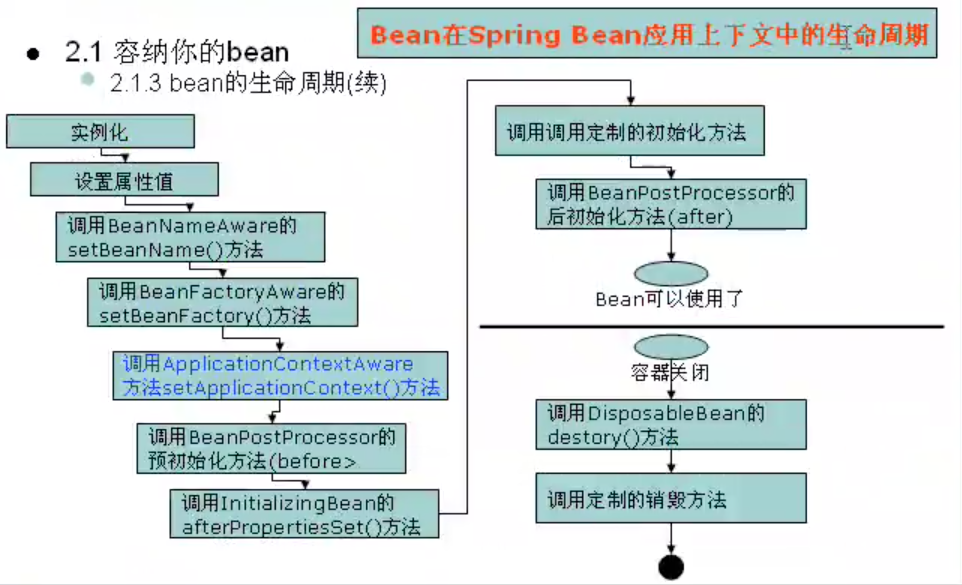

# bean的生命周期

### 1.实例化（第一步）
当我们的程序加载beans.xml文件的时候，就发生了实例化，把我们的Bean（scope=singleton）实例化到内存中。**无参**构造函数会被调用。

### 2.设置属性（第二步）
前提是有对应的set和get方法。会调用set方法设置属性。

### 3.第三步
调用BeanNameAware的setBeanName（）方法。设置bean的name
```
public class HelloWorld implements BeanNameAware {
    private String message;
    public void getMessage() {
        System.out.println("Your Message : " + message);
    }

    public void setMessage(String message) {M
        this.message = message;
    }

    //表示正在被实例化的bean的id
    @Override
    public void setBeanName(String name) {
        System.out.println("setBeanName 调用");
    }
}
```
如果实现了这个接口，则可以通过setBeanName获取id号。

### 4.第四步
调用beanFactoryAware的setBeanFactory()方法,如果你实现了这个方法，就可以获取bean工厂，可以获取到所有的bean
```
public class HelloWorld implements BeanNameAware, BeanFactoryAware {
    private String message;

    public void getMessage() {
        System.out.println("Your Message : " + message);
    }

    public void setMessage(String message) {
        this.message = message;
    }

    //表示正在被实例化的bean的id
    @Override
    public void setBeanName(String name) {
        System.out.println("setBeanName 调用" + name);
    }

    @Override
    public void setBeanFactory(BeanFactory beanFactory) throws BeansException {
        System.out.println("setBeanFactory 调用" + beanFactory);
    }
}
```

### 5.第五步
调用ApplicationContextAware接口的setApplicationContext()方法。
该方法传递applicationContext.

### 6.第六步，调用BeanPostProcessor（后置处理器）的预初始化方法。有点类似于过滤器。
这个就是AOP编程的原理。
当我实现了这个类时
```
public class MyBeanPostProcessor implements BeanPostProcessor {
    @Override
    public Object postProcessBeforeInitialization(Object bean, String beanName) throws BeansException {
        System.out.println("postProcessBeforeInitialization 被调用");
        return bean;
    }

    @Override
    public Object postProcessAfterInitialization(Object bean, String beanName) throws BeansException {
        System.out.println("postProcessAfterInitialization 被调用");
        return bean;
    }
}
```
然后配置到spring容器中
```

    @Bean
    public MyBeanPostProcessor myBeanPostProcessor(){
        return new MyBeanPostProcessor();
    }
```
会发现在实例化bean的时候，会自动被调用。



**相当于对所有的bean进行了过滤编程，在实例化每个bean的过程中，都会去调用before和after， 即面向切面编程。比如说你可以获取每个bean被创建时候的时间。**

### 7. 第7步，如果你实现了InitializingBean，当第6步的before被执行后，会首先执行这个。再执行after方法。
```
@Override
public void afterPropertiesSet() throws Exception {
    System.out.println("afterPropertiesSet() 调用");
}
```

### 8.第8步，当配置了自己的init-method时候，在第6步执行完毕后会被调用。相当于定义自己的初始化方法
```
@Configuration
public class HelloWorldConfig {


    @Bean(initMethod = "init")
    public HelloWorld helloWorld(){
        return new HelloWorld();
    }
```
也可以使用这种配置方式(和上面的方式一样，只是在不同的地方加不同的注解)
```
@PostConstruct
    public void init(){
        System.out.println("我是HelloWorld的init方法");
    }
```

### 9.如果bean和一个后置处理器关联，则会自动调用用postProcessAfterInitialization
### 10.使用bean
### 11.关闭容器，可以自己定义关闭动作
```
@Bean(destroyMethod = "")
或者
@PreDestory
```

### 12.总结
在实际开发中，往往没有用到这么多的生命周期，我们常见的是：
* 1->2->6->10->12.

### 13.上面的12步是通过Applicationcontext这个获取的。如果通过BeanFactory获取bean对象，bean的生命周期是否和Applicationcontext一样。
经测试，发现第5步，和第6步都没有了。



