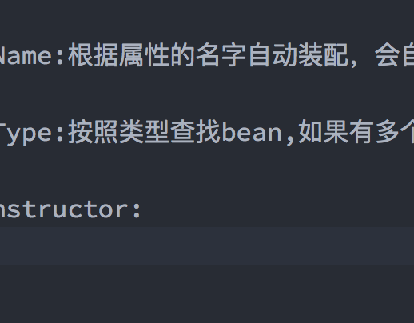
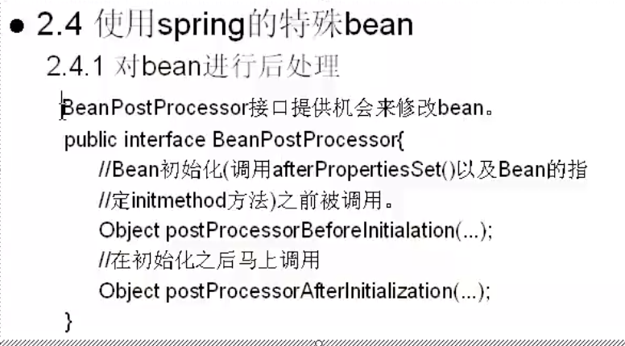
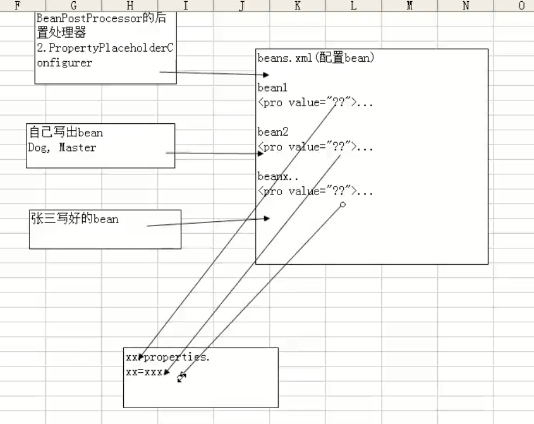

# 装配bean2

## 1.自动装配bean的属性

有五种方式：

**自动装配的原理：**

* byName:根据属性的名字自动装配，会自动扫描属性名字。
* byType:按照类型查找bean,如果有多个，就会抛出异常
* constructor:查找和bean的构造参数一致的一个或者多个bean,若找不到或找到多个，抛异常。 

  

当配置了constructor时，当创建master的bean时，发现有个dog,会默认的扫描是不是可以按照构造函数去接受这个dog.

* autodetect：在byType和constructor之间选择一个。
* default：autowire的默认值。当你在beans指定default-autowire后，所有的bean的默认autowire就是你指定的值，如果没有在 没有 defualt-autorwire=“ 指定 ” ,则默认是 defualt-autorwire=” no ”。
* no:不自动装配

## 2.spring自带的特殊的bean

### 2.1.实现了接口的后置处理器

### 2.2.分散处理

 把共有的配置提出来，放在一个文件中。然后去获取 

**注意：当需要使用多个location文件的时候，在后面用逗号隔开**

 location="classpath:com/hsp/dispatch/db.properties,classpath:com/hsp/dispatch/db2.properties"/&gt;

